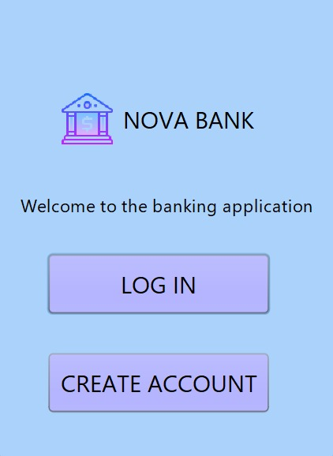
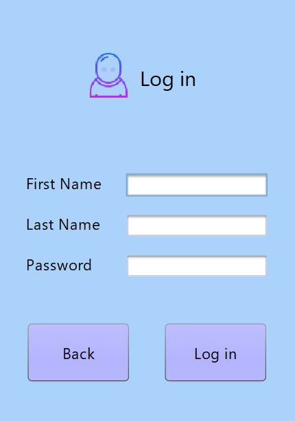
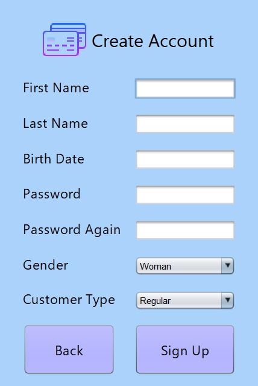
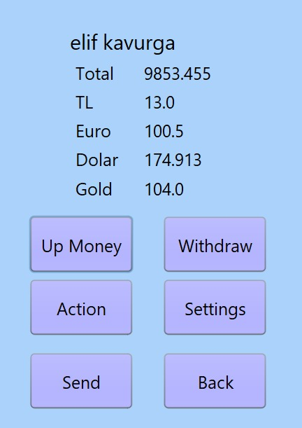
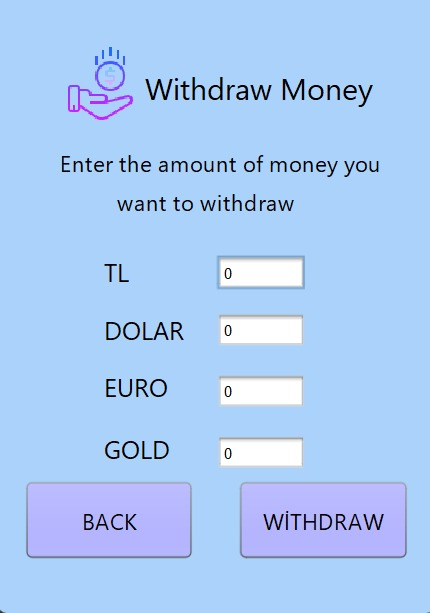
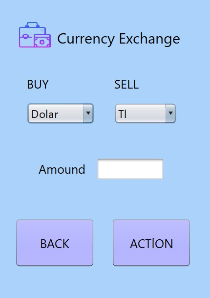
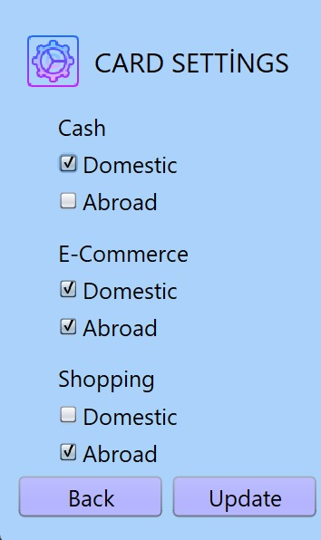
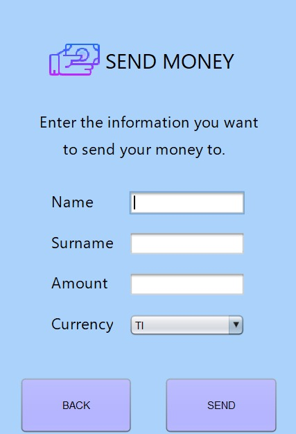

# Nova-Bank

A simple desktop banking application built with Java and MySQL. Users can register, log in, and manage their balance with multi-currency support.

---

## 🛠️ Technologies Used

- **Java (Swing)** – GUI (Graphical User Interface)
- **MySQL** – Relational database
- **JDBC (Java Database Connectivity)** – For connecting Java to MySQL
- **NetBeans IDE** – Recommended development environment

---

## 💡 Features

- ✅ Create user accounts (Student, Employer, Regular)
- ✅ Log in with name & surname
- ✅ View multi-currency balance (TL, Dollar, Euro, Gold)
- ✅ Deposit and withdraw money
- ✅ Currency exchange (buy/sell currencies)
- ✅ Send money to another user
- ✅ Card settings control (Cash, E-commerce, Shopping - domestic/abroad)
- ✅ Responsive Java Swing interface

---

## 🖼️ Screenshots

> 📸 A preview of the application's UI. All `.jpg` files are stored in the `screenshots/` folder.

### 🏦 1. Welcome Screen  


### 🔐 2. Login Screen  


### 📝 3. Create Account  


### 🏠 4. Home / Dashboard  


### 💰 5. Deposit Money  


### 💸 6. Withdraw Money  


### 💱 7. Currency Exchange  


### ⚙️ 8. Card Settings  


### 📤 9. Send Money  



## ⚙️ How to Run

1. **Clone the repository:**
   ```bash
   git clone https://github.com/elifkavurga/Nova-Bank.git
   ```

2. **Open the project in NetBeans or your preferred IDE.**

3. **Set up the MySQL database:**

   - Create the database:
     ```sql
     CREATE DATABASE nova_bank;
     ```

   - Create the `users` table:
     ```sql
     CREATE TABLE users (
         id INT PRIMARY KEY AUTO_INCREMENT,
         name VARCHAR(100) NOT NULL,
         surname VARCHAR(100) NOT NULL,
         password VARCHAR(100) NOT NULL,
         user_type VARCHAR(50) NOT NULL,

         tl_balance FLOAT DEFAULT 0,
         dollar_balance FLOAT DEFAULT 0,
         euro_balance FLOAT DEFAULT 0,
         gold_balance FLOAT DEFAULT 0,

         cash_domestic BOOLEAN DEFAULT TRUE,
         cash_abroad BOOLEAN DEFAULT TRUE,
         commerce_domestic BOOLEAN DEFAULT TRUE,
         commerce_abroad BOOLEAN DEFAULT TRUE,
         shopping_domestic BOOLEAN DEFAULT TRUE,
         shopping_abroad BOOLEAN DEFAULT TRUE
     );
     ```

4. **Configure the JDBC connection:**

   In your `DbHelper` class, update the following:
   ```java
   private String userName = "root";
   private String password = "your_mysql_password";
   private String url = "jdbc:mysql://localhost:3306/nova_bank";
   ```

5. **Run the application.**

---
